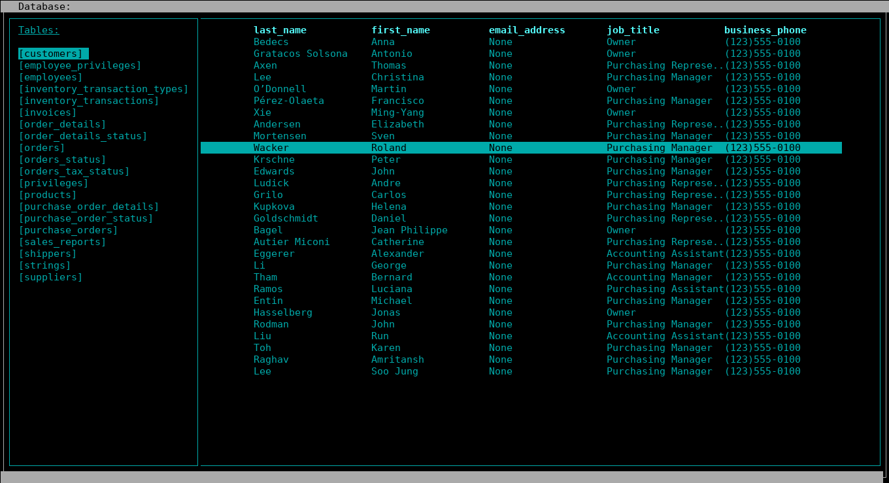

# dbcurses

This application has been realized mainly inspired by sqlcrush (https://github.com/coffeeandscripts/sqlcrush). 
The reason why I decided to create my own version of the application is the need to comfortably display the data in the MySQL database (in a SSH connection) without manually performing SELECTs, and I wasn't able to do so with sqlcrush (the project no longer seems to be maintained). Another reason is that there is no need to install postgresql. 

However, this project has far less functionality than sqlcrush for the time being and is only used to display data in the database. **Actually, only MySQL is supported.**





### Install

To install this application you can proceed with 

```bash

pip3 install dbcurses

```
or clone this repo and install manually. 


### Documentation

The following are the commands for moving through the application:

+   ```SPACEBAR``` open the menu with the list of all the tables in the database
+   ``` j/k``` or ```ARROW_DOWN/ARROW_UP``` to scroll through tables and rows
+   ``` h/l``` or ```ARROW_LEFT/ARROW_RIGHT``` to laterally scroll columns
+   ``` +/-``` to increase/decrease the size of a single column 
+   ``` ESC``` to quit the space menu
+   ``` q ``` to quit the application


### Requirements

For Ubuntu server be sure unixodbc-dev is installed. If not:

```bash
sudo apt-get install unixodbc-dev
```

### Future work

The following features will be added later:

+ Performing database queries
+ Search by column to filter results with shortcuts
